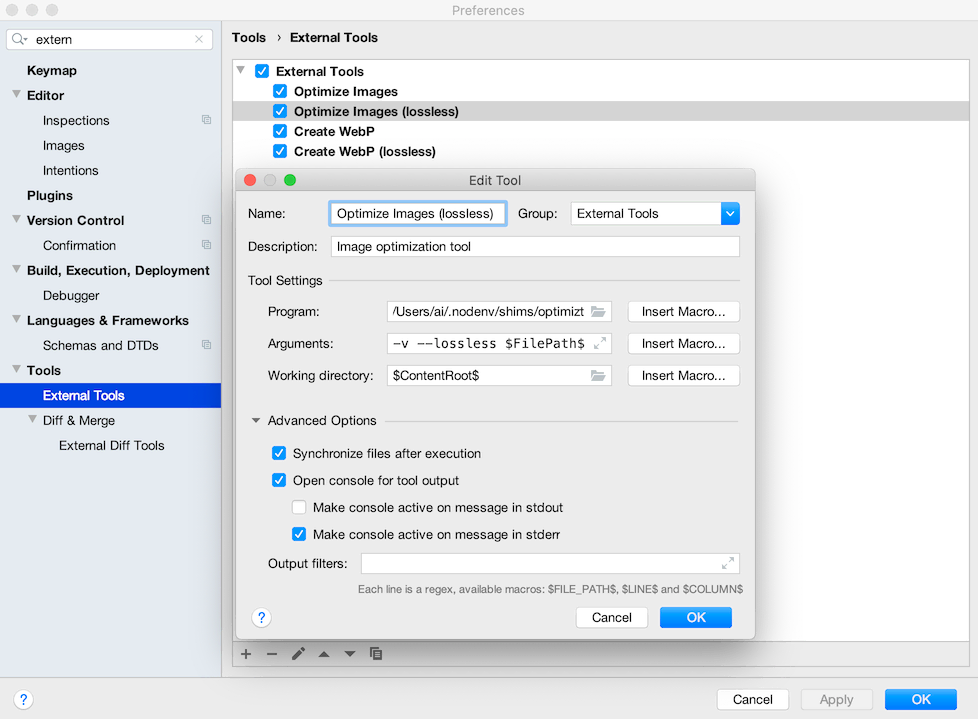
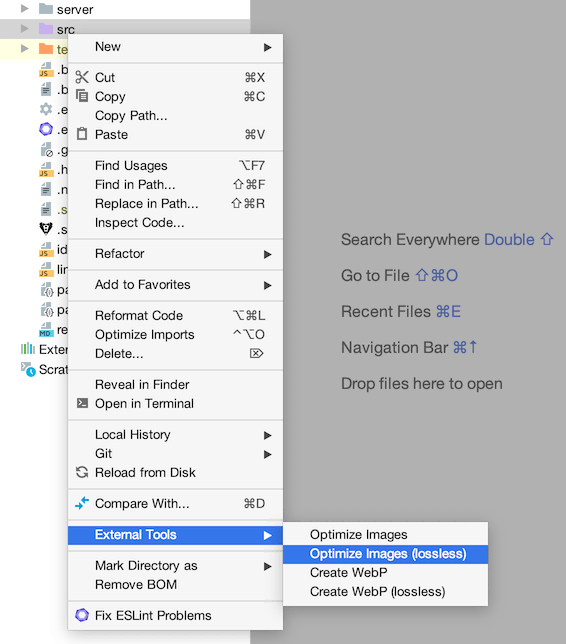
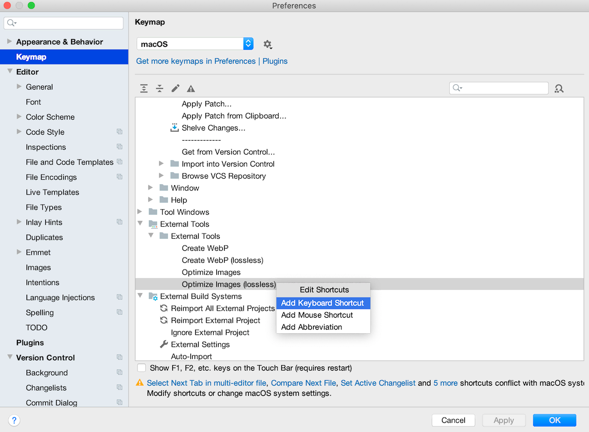
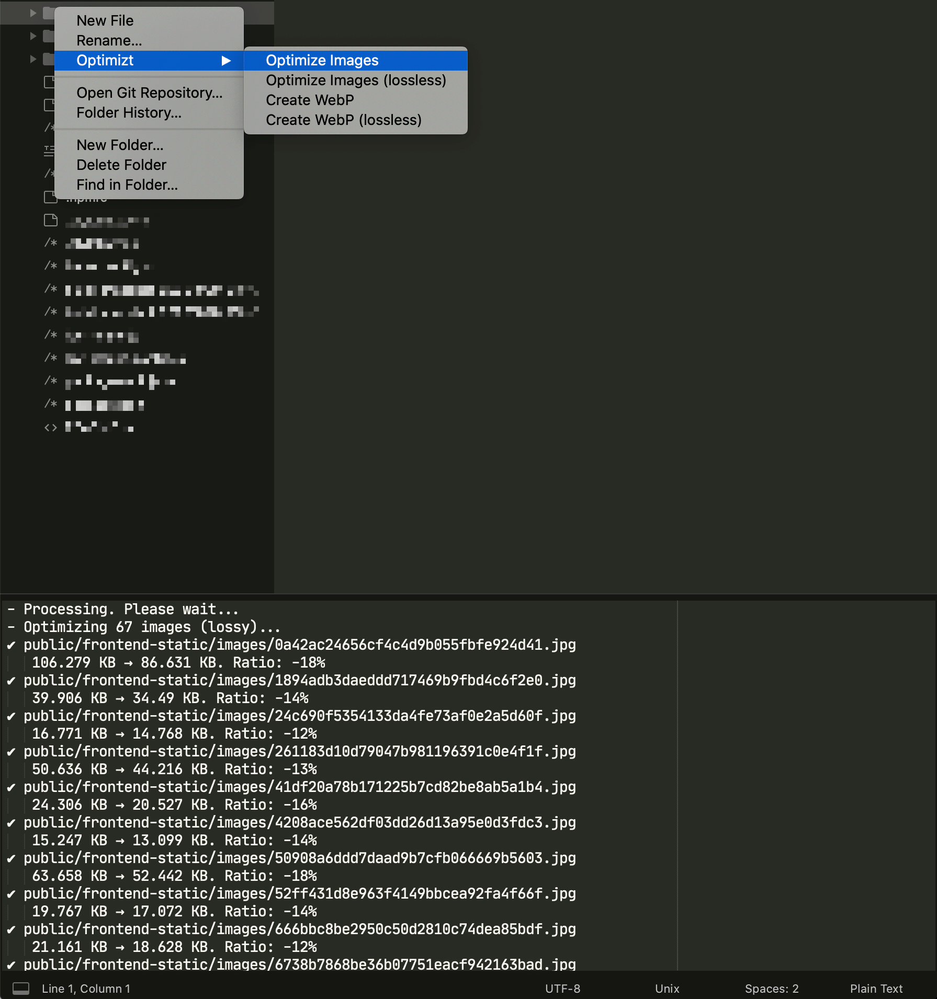

# @funboxteam/optimizt


[](https://www.npmjs.com/package/@funboxteam/optimizt)

**Optimizt** is a CLI tool that helps you prepare images during frontend development.

It can compress PNG, JPEG, GIF and SVG lossy and lossless and create AVIF and WebP versions for raster images.

[По-русски](./README.ru.md)

## Rationale

As frontend developers we have to care about pictures: compress PNG & JPEG, remove useless parts of SVG,
create AVIF and WebP for modern browsers, etc. One day we got tired of using a bunch of apps for that,
and created one tool that does everything we want.

## Usage

Install the tool:

```sh
npm i -g @funboxteam/optimizt
```

Optimize!

```sh
optimizt path/to/picture.jpg
```

## Command line flags

- `--avif` — create AVIF versions for the passed paths instead of compressing them.
- `--webp` — create WebP versions for the passed paths instead of compressing them.
- `-l, --lossless` — optimize losslessly instead of lossily.
- `-v, --verbose` — show additional info, e.g. skipped files.
- `-V, --version` — show tool version.
- `-h, --help` — show help.

## Examples

```bash
# one image optimization
optimizt path/to/picture.jpg

# list of images optimization losslessly
optimizt --lossless path/to/picture.jpg path/to/another/picture.png

# recursive AVIF creation in the passed directory
optimizt --avif path/to/directory

# recursive WebP creation in the passed directory
optimizt --webp path/to/directory

# recursive JPEG optimization in the current directory
optimizt `find . -type f -name '*.jpg'`
```

## Integrations

### External Tool in WebStorm, PhpStorm, etc

<details>

#### Add an External Tool

Open _Preferences → Tools → External Tools_ and add a new tool with these options:

- Program: path to the exec file (usually simply `optimizt`)
- Arguments: desired ones, but use `$FilePath$` to pass Optimizt the path of the selected file or directory
- Working Directory: `$ContentRoot$`
- Synchronize files after execution: ✔️

Set other options at your discretion. For example:



As you see on the screenshot above, you may add several “external tools” with the different options passed.

#### How to use

Run the tool through the context menu on a file or directory:



#### Shortcuts

To add shortcuts for the added tool go to _Preferences → Keymap → External Tools_:



</details>

### Tasks in Visual Studio Code

<details>

#### Add Task

Run `>Tasks: Open User Tasks` from the _Command Palette_.

In an open file, add new tasks to the `tasks` array, for example:

```javascript
{
  // See https://go.microsoft.com/fwlink/?LinkId=733558
  // for the documentation about the tasks.json format
  "version": "2.0.0",
  "tasks": [
    {
      "label": "optimizt: Optimize Image",
      "type": "shell",
      "command": "optimizt",
      "args": [
        "--verbose",
        {
          "value": "${file}",
          "quoting": "strong"
        }
      ],
      "presentation": {
        "echo": false,
        "showReuseMessage": false,
        "clear": true
      }
    },
    {
      "label": "optimizt: Optimize Image (lossless)",
      "type": "shell",
      "command": "optimizt",
      "args": [
        "--lossless",
        "--verbose",
        {
          "value": "${file}",
          "quoting": "strong"
        }
      ],
      "presentation": {
        "echo": false,
        "showReuseMessage": false,
        "clear": true
      }
    },
    {
      "label": "optimizt: Create WebP",
      "type": "shell",
      "command": "optimizt",
      "args": [
        "--webp",
        "--verbose",
        {
          "value": "${file}",
          "quoting": "strong"
        }
      ],
      "presentation": {
        "echo": false,
        "showReuseMessage": false,
        "clear": true
      }
    },
    {
      "label": "optimizt: Create WebP (lossless)",
      "type": "shell",
      "command": "optimizt",
      "args": [
        "--webp",
        "--lossless",
        "--verbose",
        {
          "value": "${file}",
          "quoting": "strong"
        }
      ],
      "presentation": {
        "echo": false,
        "showReuseMessage": false,
        "clear": true
      }
    }
  ]
}
```

#### How to use

1. Open the file for processing using Optimizt, it should be in the active tab.
2. Run `>Tasks: Run Task` from the _Command Palette_.
3. Select the required task.

#### Shortcuts

You can add shortcuts for a specific task by run `>Preferences: Open Keyboard Shortcuts (JSON)` from the _Command Palette_.

An example of adding a hotkey to run the "optimizt: Optimize Image (lossless)" task:

```javascript
// Place your key bindings in this file to override the defaults
[
  {
    "key": "ctrl+l",
    "command": "workbench.action.tasks.runTask",
    "args": "optimizt: Optimize Image (lossless)"
  }
]
```

</details>

### Plugin for Sublime Text 3

<details>

You’ll find the user settings directory in one of the following paths:

- macOS: `~/Library/Application Support/Sublime Text 3/Packages/User`
- Linux: `~/.config/sublime-text-3/Packages/User`
- Windows: `%APPDATA%\Sublime Text 3\Packages\User`

#### Add plugin

Inside the settings directory create a file `optimizt.py` with the following content:

```python
import os
import sublime
import sublime_plugin

optimizt = "~/.nodenv/shims/optimizt"

class OptimiztCommand(sublime_plugin.WindowCommand):
  def run(self, paths=[], options=""):
    if len(paths) < 1:
      return

    safe_paths = ["\"" + i + "\"" for i in paths]
    shell_cmd = optimizt + " " + options + " " + " ".join(safe_paths)
    cwd = os.path.dirname(paths[0])

    self.window.run_command("exec", {
      "shell_cmd": shell_cmd,
      "working_dir": cwd
    })
```

Specify path to executable inside `optimizt` variable, this path can be obtained by running
`command -v optimizt` (on *nix) or `where optimizt` (on Windows).

#### Integrate the plugin into the sidebar context menu

Inside the settings directory create a file `Side Bar.sublime-menu` with the following content:

```json
[
    {
        "caption": "Optimizt",
        "children": [
          {
              "caption": "Optimize Images",
              "command": "optimizt",
              "args": {
                "paths": [],
                "options": "--verbose"
              }
          },
          {
              "caption": "Optimize Images (lossless)",
              "command": "optimizt",
              "args": {
                "paths": [],
                "options": "--lossless --verbose"
              }
          },
          {
              "caption": "Create WebP",
              "command": "optimizt",
              "args": {
                "paths": [],
                "options": "--webp --verbose"
              }
          },
          {
              "caption": "Create WebP (lossless)",
              "command": "optimizt",
              "args": {
                "paths": [],
                "options": "--webp --lossless --verbose"
              }
          }
        ]
    }
]
```

#### How to use

Run the tool through the context menu on a file or directory:



</details>

### Workflow for Github Workflow

<details>

#### Add Workflow

Add the following file in the following location:
`.github/workflows/optimizt.yml`

Insert the following into optimizt.yml
```yml
name: AVIF
on:
  # Triggers the workflow on push or pull request events but only for the main branch and only when there's JPG/JPEG/PNG in the commmit!
  push:
    branches: [main]
    paths:
      - "**.jpg"
      - "**.jpeg"
      - "**.png"
  pull_request:
    branches: [main]
    paths:
      - "**.jpg"
      - "**.jpeg"
      - "**.png"

  # Allows you to run this workflow manually from the Actions tab
  workflow_dispatch:

jobs:
  Convert-to-WEBP:
    runs-on: ubuntu-latest
    env:
      OPTIMIZTCONVERTERARGS: --avif --webp . # convert to avif and webp for all JPG/JPEG/PNG files in this folder
    steps:
      - name: Install dependencies
        run: | # install optimizt
          sudo npm i -g @funboxteam/optimizt --unsafe-perm
      - uses: actions/checkout@v2 # This is a premade github action
        with:
          persist-credentials: false # otherwise, the token used is the GITHUB_TOKEN, instead of your personal token
          fetch-depth: 0 # otherwise, you will failed to push refs to dest repo
      - name: run optimizt
        run: optimizt ${OPTIMIZTCONVERTERARGS}
      - name: Compress Images
        id: calibre
        uses: calibreapp/image-actions@main
        with:
          githubToken: ${{ secrets.GITHUB_TOKEN }}
          compressOnly: true # Needed to not get a pullrequest and just compress
          jpegQuality: '80'
          jpegProgressive: false
          pngQuality: '80'
          webpQuality: "80"
      #- name: Commit files
      #  run: |
      #    git add .
      #    git config --local user.email "actions@github.com"
      #    git config --local user.name "github-actions[bot]"
      #    git diff --quiet && git diff --staged --quiet || git commit -am "Converted all JPG/JPEG/PNG files into compressed WEBP & AVIF"
      #- name: Push changes
      #  uses: ad-m/github-push-action@master # This is a premade github action
      #  with:
      #    github_token: ${{ secrets.GITHUB_TOKEN }}
      #    branch: ${{ github.ref }}
      - name: Create Pull Request
        uses: peter-evans/create-pull-request@v3
        with:
          delete-branch: true
          title: 'Converted & Optimized JPG/JPEG/PNG to WEBP & AVIF!'
          branch: optimizt
          labels: optimizt
          body: |
            What did this pull do?
            - Start automatically when new files were added containing JPG/JPEG/PNG/WEBP/AVIF
            - Convert all images from JPG/JPEG/PNG to WEBP and AVIF format (100% quality, lossless)
            - Compress all images (excluding AVIF) (80% quality compression)
            - Commit and push changes to a pull request, rather then direct commit (because of conflict if someone pushes to main during the workflow or if code changes are needed to use AVIF and/or WEBP)
      
            What did this pull do not?
            - It does not change code. To use AVIF and WEBP it's required to use the <picture> element and present each image in AVIF > WEBP > JPG/JPEG/PNG in that order.
      
            Please review this pull carefully, as it will:
            - Change the looks of the images (due to conversion and compression)
      
            If this pull recieves a conflict, just close this pull and continue with the newer one
            As the newer pull will be based on a more recent commit and will include the current changes aswell
      
            Delete the Branch after the pull is merged.

```

#### What does it do?

This workflow will trigger whenever a jpg, jpeg or png file is added, removed or changed.
Then the workflow will install optimizt trough npm with sudo and --unsafe-perm to install it successfully.
The current repository will be checkout and then optimizt will do the following by default:
- Create AVIF from all images in the repository
- Create WEBP from all images in the repository
Next calibre is used to compress the jpg, jpeg, png and webp files futher with 80% quality.

#### Push changes trough commit

If the changes need to be pushed trough commit automatically, comment out the: `Create Pull Request` task entirely.
Uncomment the `Commit files` task entirely.

#### Push changes trough pull

If the changes need to be push trough a pull request, the configuration as is will achieve this.

</details>

## Troubleshooting

### “spawn jpegoptim ENOENT”, “spawn guetzli ENOENT”, etc

Make sure that the [ignore-scripts](https://docs.npmjs.com/cli/v6/using-npm/config#ignore-scripts) option is not active.

More info: [#9](https://github.com/funbox/optimizt/issues/9).

### “Cannot find libjpeg”, “pkg-config: command not found”, “fatal error: 'png.h' file not found”, etc

Some operating systems may lack of required libraries and utils, so you need to install them.

Example (on macOS via [Homebrew](https://brew.sh)):

```bash
brew install pkg-config jpeg libpng
```

## Credits

Cute picture for the project was made by [Igor Garybaldi](http://pandabanda.com/).

[](https://funbox.ru)
