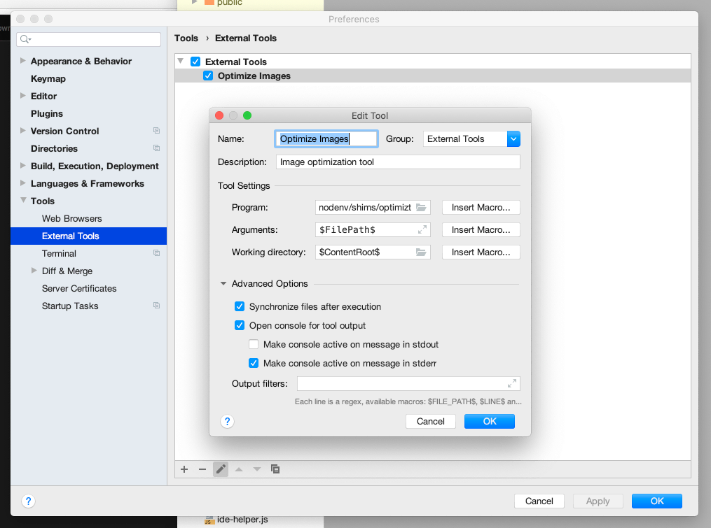
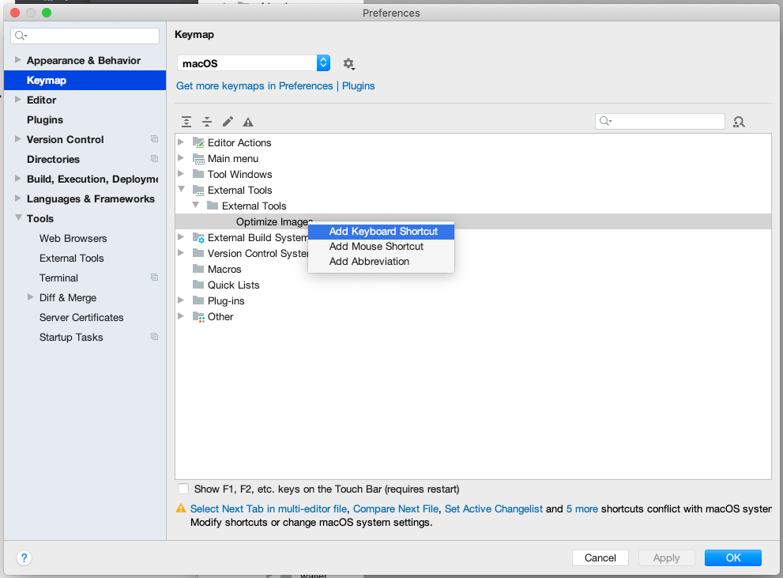

# optimizt

Скрипт для оптимизации изображений.

## Установка

```sh
npm i -g @funboxteam/optimizt
```

## Подключение через External Tools в WebStorm

### Добавление инструмента

Перейти в _Preferences → Tools → External Tools_ и добавить новый инструмент со следующими параметрами:

- Name: `Optimize Images`
- Description: `Image optimization tool`
- Program: `Путь до исполняемого файла`
- Arguments: `$FilePath$`
- Working Directory: `$ContentRoot$`
- Synchronize files after execution
- Open console for tool output



### Использование

После добавления утилиты вызов может производиться правой кнопкой при клике на директории или файле с изображением:


### Горячие клавиши

Для назначения горячих клавиш нужно перейти в _Preferences → Keymap → External Tools_.


